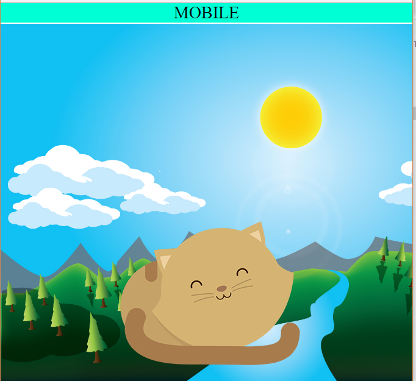
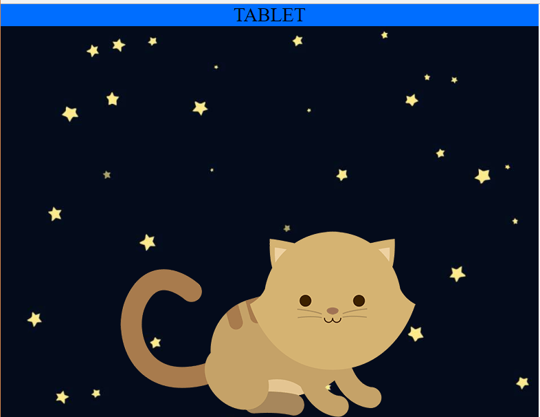
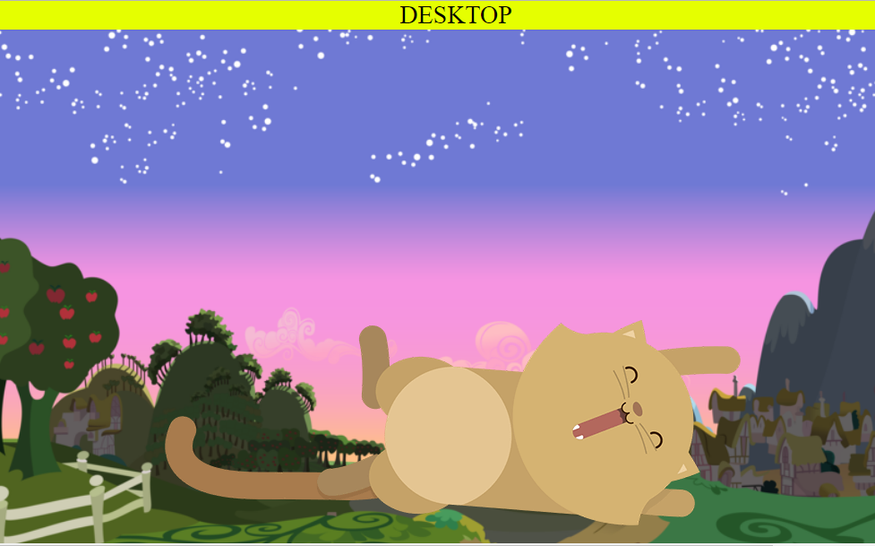

# KITTEN

* **Track:** _Common Core_
* **Curso:** _Crea tu propia red social_
* **Unidad:** _La web desde un móvil_

***
En este reto se consiguio tener diferentes fondos e imagenes de acuerdo al tamaño de nuestra pantalla,es decir una pagina *responsive* tanto para mobile,tablet y desktop.

## Desarrollo:
* En  nuestra pagina mobile tenemos el siguiente resultado.

* En nuestro diseño para tablet utilizamos el query
*@media (min-width: 768px)*

* En el diseño de desktop utilizamos el query 
*@media (min-width: 992px)*

